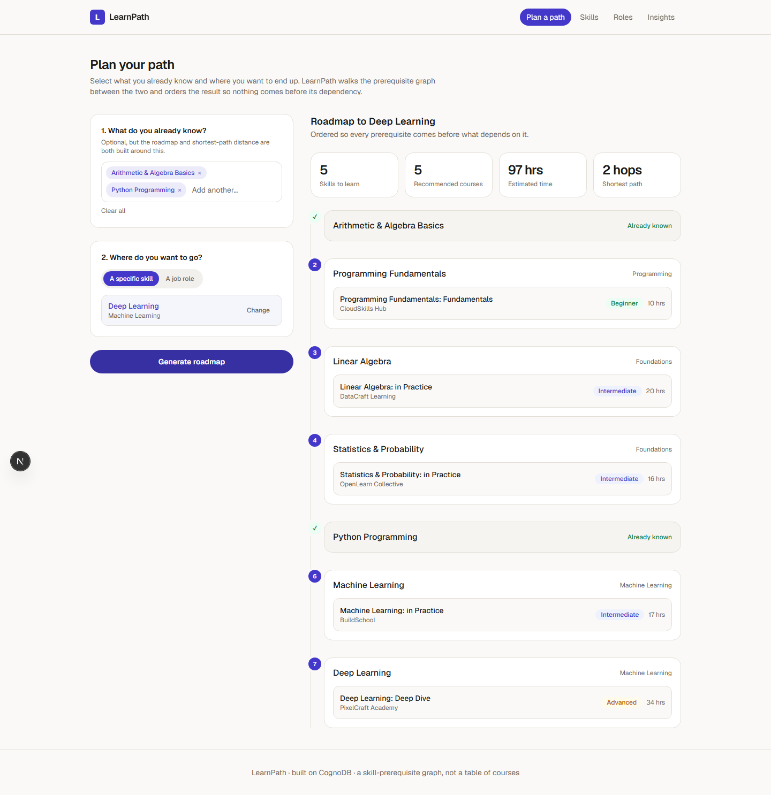
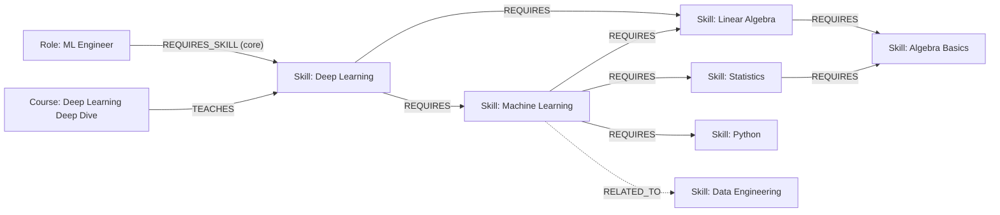
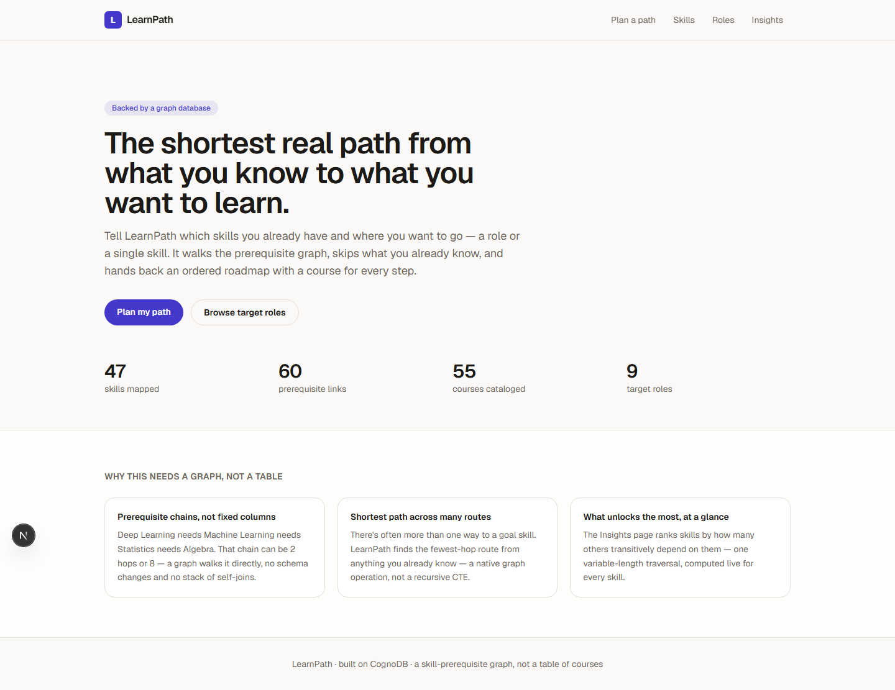
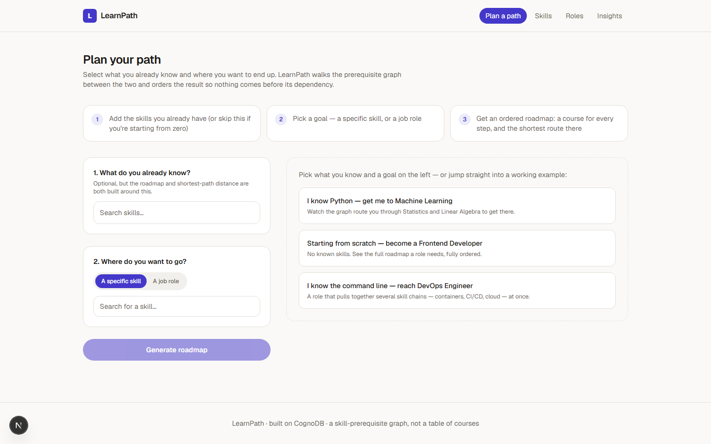
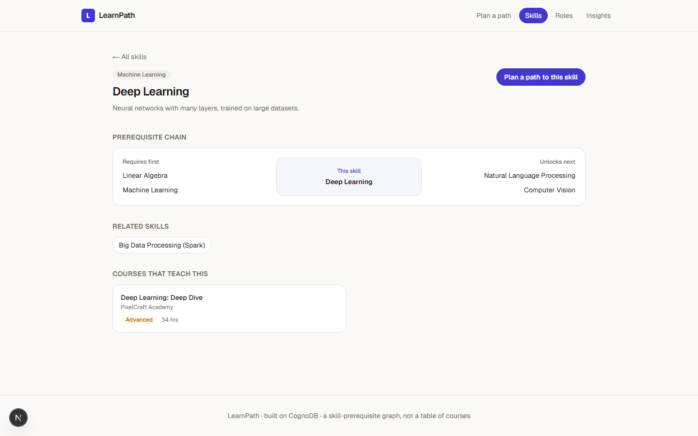
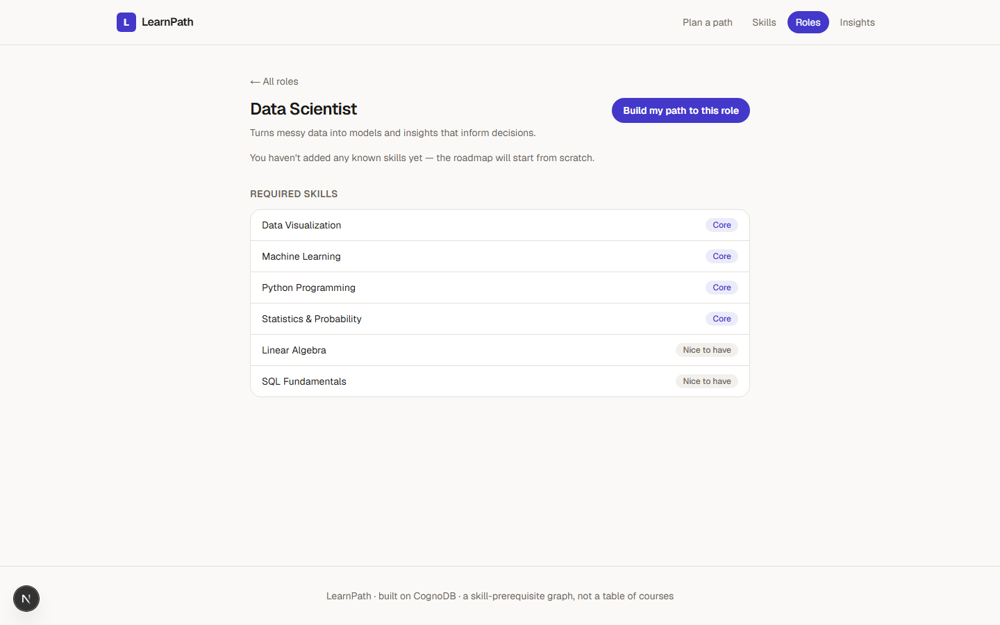
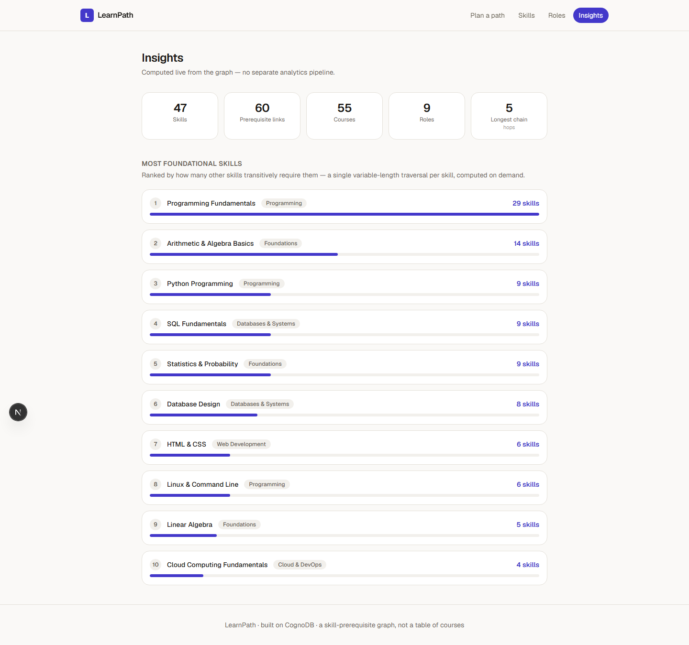
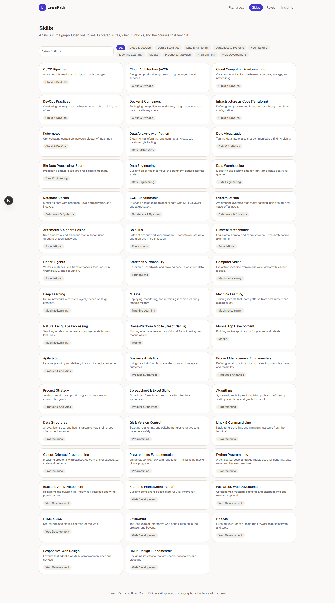
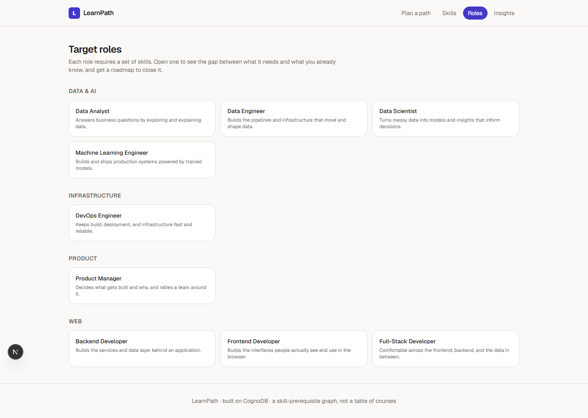
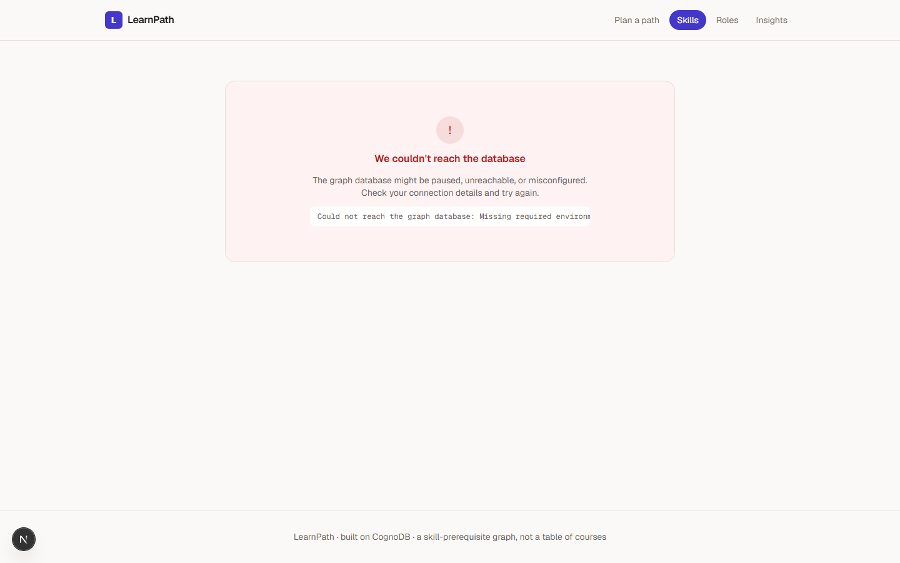

# LearnPath

**Tell it what skills you already have and where you want to go — a role or a single skill — and it walks a skill-prerequisite graph to hand back an ordered roadmap, with a course recommended for every step.**

Built for the Wexa AI CognoDB take-home. Data layer is [CognoDB](https://console.cognodb.com) (openCypher over Bolt), queried through the official `neo4j-driver` for Node.



- **Live demo:** _add your hosted URL here_
- **Screen recording:** _add your recording link here_

---

## Contents

- [The use case](#the-use-case)
- [Why a graph database?](#why-a-graph-database)
- [Data model](#data-model)
- [Getting started](#getting-started)
- [The main queries](#the-main-queries)
- [Project structure](#project-structure)
- [Error handling](#error-handling)
- [Deployment](#deployment)
- [Screenshots](#screenshots)

---

## The use case

Most course platforms sell you a catalog. Almost none of them can answer "**what, in order, do I actually need to learn to get from Python to Deep Learning** — and what does that look like if I already know statistics?" That's a graph question wearing a course-recommendation costume: it's about which skills unlock which other skills, and the shortest chain between two of them.

LearnPath is a small app around that question:

- **Plan a path** — pick the skills you already know and a goal (a specific skill, or a target job role like "Data Scientist"). It returns a dependency-ordered roadmap: every prerequisite appears before whatever needs it, each unmet step gets a recommended course, and you get the total estimated hours and the shortest number of hops from what you know to the goal. First-time visitors get a plain-language "how it works" strip and three one-click examples that generate a real roadmap immediately — no need to understand the concept before trying it.
- **Skills** — browse the skill graph, and open one to see its direct prerequisites, what it unlocks, related skills, and the courses that teach it.
- **Roles** — nine target job roles, each with required skills split into "core" and "nice to have."
- **Insights** — which skills are most "foundational" (unlock the most downstream skills), computed live from the graph.

Every screen is meant to be usable by someone with zero interest in Cypher — a student picking a next course, or someone mapping a career switch. Every list has a loading skeleton, every empty result has a specific explanation instead of a blank space, and every database-backed page degrades to a plain-language error state (still a normal `200` page, fully server-rendered — no client JS required to see it) if CognoDB is unreachable.

## Why a graph database?

The whole premise of this app is prerequisite *chains* of unknown, varying length, and the queries that matter all fall out of that:

- **A prerequisite chain isn't a fixed number of hops.** Deep Learning needs Machine Learning needs Statistics + Linear Algebra needs Algebra Basics — four hops. A different goal skill might be one hop, or eight. In a relational schema you either hard-code a maximum join depth (`skill JOIN prereq JOIN prereq JOIN prereq...`) and it breaks the day someone adds a fifth level, or you write a recursive CTE and re-derive it per query. In Cypher it's one pattern, `(goal)-[:REQUIRES*0..8]->(skill)`, and it doesn't care how deep the real chain turns out to be.
- **"Shortest path" is a first-class graph operation.** There's often more than one legitimate route from what you know to a goal skill. `shortestPath()` finds the cheapest of many possible variable-length routes directly; the relational equivalent means materializing every candidate route before you can compare them.
- **Multi-source traversal falls out for free.** A Role usually requires 4–6 skills at once, each with its own prerequisite closure. Getting the *union* of those closures, de-duplicated, is one `UNWIND` + traversal in Cypher. In SQL that's a stack of `UNION ALL` recursive CTEs, one per starting skill.
- **"What unlocks the most?" is a relational database's nightmare query, not a hard one.** [Insights](#the-main-queries) ranks every skill by how many other skills transitively depend on it — a variable-length traversal computed for *every node*, in one query. The relational version is a recursive self-join re-run once per candidate skill, or a closure table you'd have to maintain by hand as the graph changes.

None of this needed schema foresight, either — `Course`, `Role`, and the `RELATED_TO` layer were added without touching how `Skill` or `REQUIRES` already worked. See [docs/queries.cypher](docs/queries.cypher) for the exact Cypher behind each of these, annotated.

## Data model



**Nodes**

| Label | Properties | What it represents |
|---|---|---|
| `Skill` | `id, name, category, description` | A learnable competency |
| `Course` | `id, title, provider, level, hours, url` | Something that teaches one or more skills |
| `Role` | `id, title, category, description` | A job role defined by the skills it needs |

**Relationships**

| Relationship | Direction | Meaning |
|---|---|---|
| `(:Skill)-[:REQUIRES]->(:Skill)` | source needs target first | Prerequisite edge — the backbone of the whole app |
| `(:Skill)-[:RELATED_TO]-(:Skill)` | undirected | Lateral, non-prerequisite suggestion ("people learning X often also explore Y") |
| `(:Course)-[:TEACHES]->(:Skill)` | course → skill | A course covers a skill (sometimes several at once) |
| `(:Role)-[:REQUIRES_SKILL {importance}]->(:Skill)` | role → skill | `importance` is `"core"` or `"nice-to-have"` |

Full constraint definitions: [docs/schema.cypher](docs/schema.cypher).

**Seed data:** 47 skills, 60 prerequisite links, 16 related-skill links, 55 courses, 65 course→skill links, 9 roles, 48 role requirements — see `scripts/data/`.

## Getting started

### 1. Create a CognoDB instance

1. Sign up at [console.cognodb.com/signup](https://console.cognodb.com/signup) (free, no card required).
2. Create a free **c0** instance and pick a region — it provisions in under a minute.
3. Copy the connection URI (`bolt+s://<instance-id>.databases.cognodb.cloud`) and the generated password for user `cognodb`. **The password is shown exactly once** — save it now.

### 2. Configure the app

```bash
cp .env.example .env.local
```

Fill in the three values:

```
NEO4J_URI=bolt+s://<instance-id>.databases.cognodb.cloud
NEO4J_USERNAME=cognodb
NEO4J_PASSWORD=<your generated password>
```

`.env.local` is git-ignored — nothing here ever gets committed.

### 3. Install, seed, run

```bash
npm install
npm run validate-data   # optional: checks the seed dataset for dangling refs / cycles
npm run seed            # wipes and loads Skills, Courses, Roles into CognoDB
npm run dev             # http://localhost:3000
```

For production:

```bash
npm run build
npm start
```

## The main queries

The app's data-access layer (`lib/queries/*.ts`) issues parameterized Cypher through `neo4j-driver` — never string-concatenated. The ones worth reading:

| Query | Where | What it does |
|---|---|---|
| Full prerequisite closure | `lib/queries/plan.ts` → `fetchClosureFromGoals` | `(goal)-[:REQUIRES*0..8]->(skill)` — every transitive prerequisite of a goal skill, any depth, one traversal |
| Shortest path to a goal | `lib/queries/plan.ts` → `shortestHops` | `shortestPath((goal)-[:REQUIRES*0..8]->(known))` — fewest hops from anything you know to the goal |
| Multi-source role closure | `lib/queries/plan.ts` → `planForRole` | Same closure traversal, seeded from every skill a Role requires at once, de-duplicated |
| Foundational skills | `lib/queries/insights.ts` → `getFoundationalSkills` | For every skill, counts how many others transitively depend on it — one variable-length traversal + aggregation, computed live |
| Skill detail | `lib/queries/skills.ts` → `getSkillDetail` | Four relationship types (prereqs, unlocks, related, courses) via pattern comprehensions from one node, without a cartesian blow-up |
| Course overlap | `lib/queries/courses.ts` → `getCourseDetail` | Two-hop `Course -> Skill <- Course` to find courses with overlapping skill coverage |

Each is reproduced with full annotation (params, and *why* it's the kind of query a relational schema struggles with) in [docs/queries.cypher](docs/queries.cypher).

Roadmap ordering itself (turning an unordered prerequisite closure into a step-by-step sequence, and picking the best-fit course per step) is graph *traversal* output shaped by plain application code — `lib/roadmap.ts` — since topological sort and greedy course selection aren't things you'd want to force into Cypher.

## Project structure

```
app/                    Next.js App Router — pages + API routes
  api/                   REST endpoints (skills, roles, courses, plan, insights, health)
  plan/, skills/, roles/, courses/, insights/   UI routes
components/             Reusable UI (pickers, badges, states, roadmap timeline)
hooks/                  useKnownSkills — localStorage-backed "skills I know" profile
lib/
  db.ts                  Driver singleton, parameterized read/write helpers, error typing
  mappers.ts              Neo4j Node -> typed object conversion
  queries/                One file per domain: skills, roles, courses, plan, insights
  roadmap.ts              Topological sort + course selection over a fetched closure
scripts/
  seed.ts                 Wipes and reloads CognoDB from scripts/data/
  validate-data.ts        Referential-integrity + cycle check for the seed dataset
  data/                   skills.ts, courses.ts, roles.ts — the seed dataset itself
docs/
  schema.cypher            Constraints + node/relationship shapes
  queries.cypher            Annotated copies of the main queries
  screenshots/               README images
```

## Error handling

Every DB call goes through `lib/db.ts`, which wraps connection and query failures in a typed `DatabaseUnavailableError`. API routes convert that into a `503` with a readable message (`lib/api-helpers.ts`); server-rendered pages `try`/`catch` around the fetch (not the JSX — the render itself stays outside the `catch` block) and render an inline "couldn't reach the database" state instead of crashing (`components/States.tsx`), which keeps the response a fully server-rendered `200`, not a client-hydrated `500`; the client-side planner does the same for its own fetches. Verified by pointing the app at a deliberately wrong password and confirming every DB-backed route still returns `200` with the graceful message, with no client JS required.

## Deployment

The app is a standard Next.js app — deploy it anywhere Next.js runs (Vercel's free tier is the easiest path):

1. Push this repo to GitHub.
2. Import it into Vercel.
3. Add `NEO4J_URI`, `NEO4J_USERNAME`, `NEO4J_PASSWORD` as environment variables in the Vercel project settings.
4. Deploy. The CognoDB instance already has data from `npm run seed` — no build-time DB access is required (every DB-backed page is `export const dynamic = "force-dynamic"`, so nothing runs against the database until a real request comes in).

## Screenshots

| | |
|---|---|
|  Home |  Plan a path — first visit, with quick-start examples |
|  Generated roadmap |  Skill detail |
|  Role detail |  Insights |
|  Skills browser |  Roles |
|  Graceful DB-unreachable state | |
